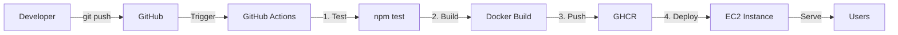

# DeployReady — Automated Deployment Pipeline

A containerized Node.js API with full CI/CD automation, deployed to AWS EC2.

---

## 🚀 Live Demo

**Public Endpoint:** http://54.89.125.94

**Available Routes:**
- `GET /health` — Health check endpoint
- `GET /metrics` — System metrics (uptime, memory usage)
- `POST /data` — Echo JSON payload

---

## 📋 Project Overview

This project demonstrates core DevOps practices:
- **Containerization** with Docker
- **Automated CI/CD** with GitHub Actions
- **Cloud Deployment** on AWS EC2
- **Infrastructure as Code** principles

### Architecture

```
Developer Push → GitHub Actions → Build & Test → Push to GHCR → Deploy to EC2 → Live Application
```

---

## 🛠️ Technology Stack

| Component | Technology |
|-----------|------------|
| Application | Node.js + Express |
| Containerization | Docker |
| CI/CD | GitHub Actions |
| Container Registry | GitHub Container Registry (GHCR) |
| Cloud Provider | AWS EC2 (Ubuntu 26.04 LTS) |
| Instance Type | t3.micro (1 vCPU, 1 GiB RAM) |

---

## 📦 Local Development

### Prerequisites

- Docker Desktop installed
- Node.js 18+ (for local testing without Docker)

### Run with Docker Compose

```bash
cd DeployReady
docker compose up --build
```

The API will be available at `http://localhost:3000`

### Run without Docker

```bash
cd app
npm install
npm start
```

### Run Tests

```bash
cd app
npm test
```

---

## 🔄 CI/CD Pipeline

The deployment pipeline is fully automated via GitHub Actions (`.github/workflows/deploy.yml`).

### Pipeline Stages

1. **Test** — Runs `npm test`. If tests fail, deployment stops.
2. **Build** — Builds Docker image tagged with commit SHA and `latest`
3. **Push** — Pushes image to GitHub Container Registry
4. **Deploy** — SSHs into EC2, pulls new image, restarts container

### Trigger

The pipeline runs automatically on every push to the `main` branch.

### Secrets Configuration

The following GitHub Secrets are required:

| Secret Name | Description |
|-------------|-------------|
| `EC2_SSH_KEY` | Private SSH key (.pem file) for EC2 access |
| `EC2_SERVER_IP` | Public IP address of the EC2 instance |
| `GITHUB_TOKEN` | Automatically provided by GitHub Actions |

---

## ☁️ Cloud Infrastructure

### AWS EC2 Instance

- **AMI:** Ubuntu Server 26.04 LTS
- **Instance Type:** t3.micro (free tier eligible)
- **Region:** us-east-1
- **Storage:** 8 GiB gp3

### Security Group Rules

| Type | Port | Source | Purpose |
|------|------|--------|---------|
| SSH | 22 | 0.0.0.0/0 | GitHub Actions deployment |
| HTTP | 80 | 0.0.0.0/0 | Public web traffic |

### Docker Configuration

The application runs in a Docker container:
- **Image:** `ghcr.io/trtheo/deployready:latest`
- **Port Mapping:** Host port 80 → Container port 3000
- **Restart Policy:** `unless-stopped`
- **User:** Non-root user for security

---

## 📖 Documentation

For detailed deployment information, see [DEPLOYMENT.md](./DEPLOYMENT.md), which covers:
- Cloud provider selection and rationale
- VM setup and configuration
- Docker installation steps
- Container management commands
- Log viewing and troubleshooting

---

## 🔐 Security Features

- Container runs as **non-root user**
- Environment variables managed via `.env` files (not committed)
- SSH keys stored as GitHub Secrets
- Docker image scanning via GitHub Container Registry
- Security group restricts access to necessary ports only

---

## 🧪 Testing the Deployment

### Health Check

```bash
curl http://54.89.125.94/health
```

**Expected Response:**
```json
{
  "status": "ok"
}
```

### Metrics Endpoint

```bash
curl http://54.89.125.94/metrics
```

**Expected Response:**
```json
{
  "uptime_seconds": 3600,
  "memory_mb": 45,
  "node_version": "v18.x.x"
}
```

### Data Echo Endpoint

```bash
curl -X POST http://54.89.125.94/data \
  -H "Content-Type: application/json" \
  -d '{"message": "Hello, World!"}'
```

**Expected Response:**
```json
{
  "received": {
    "message": "Hello, World!"
  }
}
```

---

## 📊 Monitoring

### Check Container Status

```bash
ssh -i newkeypair.pem ubuntu@54.89.125.94
docker ps
```

### View Application Logs

```bash
docker logs -f deployready
```

### System Metrics

```bash
docker stats deployready
```

---

## 🚧 Design Decisions

### 1. Why Docker?

- **Consistency:** Same environment in development, testing, and production
- **Portability:** Easy to move between cloud providers
- **Isolation:** Application dependencies don't conflict with system packages
- **Efficiency:** Lightweight compared to VMs

### 2. Why GitHub Container Registry?

- **Integration:** Native GitHub integration, no extra accounts needed
- **Security:** Automatic vulnerability scanning
- **Free:** Unlimited public images, generous private image allowance
- **Performance:** Fast pulls from GitHub Actions runners

### 3. Why AWS EC2?

- **Free Tier:** t3.micro is free for 12 months
- **Simplicity:** Direct VM access for learning purposes
- **Flexibility:** Full control over the environment
- **Industry Standard:** Most widely used cloud platform

### 4. Why Ubuntu 26.04 LTS?

- **Long-term Support:** 5 years of security updates
- **Docker Support:** Excellent Docker compatibility
- **Community:** Large community and extensive documentation
- **Familiarity:** Widely used in production environments

---

## 🔄 Deployment Workflow



---

## 📈 Future Improvements

- [ ] Implement HTTPS with Let's Encrypt SSL
- [ ] Add AWS CloudWatch monitoring and alarms
- [ ] Use AWS Systems Manager instead of SSH
- [ ] Implement blue-green deployment strategy
- [ ] Add automated rollback on health check failure
- [ ] Set up AWS Application Load Balancer
- [ ] Implement infrastructure as code with Terraform
- [ ] Add database integration (RDS)
- [ ] Implement rate limiting and DDoS protection

---

## 📝 Project Structure

```
DeployReady/
├── .github/
│   └── workflows/
│       └── deploy.yml          # CI/CD pipeline configuration
├── app/
│   ├── index.js                # Express application
│   ├── index.test.js           # Jest tests
│   └── package.json            # Node.js dependencies
├── .env                        # Environment variables (gitignored)
├── .env.example                # Example environment variables
├── .gitignore                  # Git ignore rules
├── docker-compose.yml          # Docker Compose configuration
├── Dockerfile                  # Docker image definition
├── DEPLOYMENT.md               # Detailed deployment guide
└── README.md                   # This file
```

---

## 🤝 Contributing

This is a learning project for the AmaliTech DEG Program. Contributions are welcome!

---

## 📄 License

This project is part of the AmaliTech DEG Project-based Challenges.

---

## 👤 Author

**Trtheo**  
GitHub: [@Trtheo](https://github.com/Trtheo)

---

## 🙏 Acknowledgments

- AmaliTech Training Academy for the project challenge
- AWS Free Tier for hosting
- GitHub Actions for CI/CD automation
